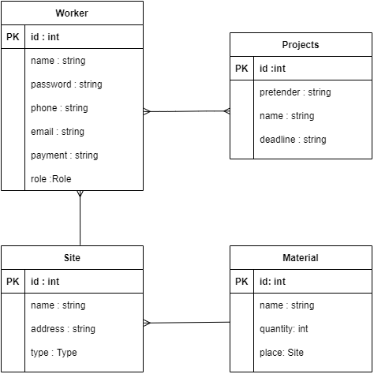
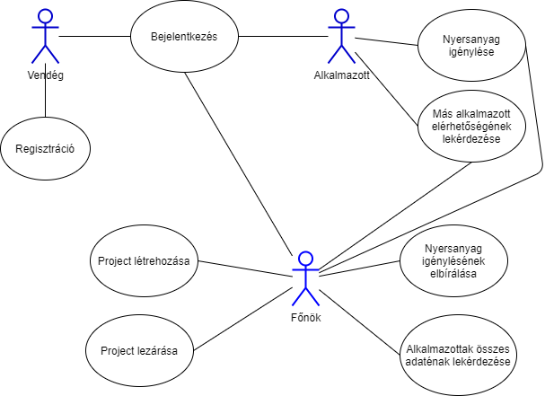

# fullstackCompany
## Projectötlet
A project célja egy céges alkalmazás megalkozása, ami lehetőséget nyújt az alkalmazottak személyes adatainak tárolására, projectek managementjére, és külöböző kellékek (nyersanyagok) igényléseinek lebonyolítására akár több telephelyen.

## Fejlesztők
* Pap Gábor

* Takács László Kristóf

## Adatbázisok
* Alkalmazottak (id, jelszó, név, e-mail cím, telefonszám, fizetés, beosztás)

* Projectek(id, név, igénylő, határidő)

* Telephelyek(név, cím, típus)

* Nyersanyagok(id, név, mennyiség, hely)

## Objektumok kapcsolatai
* **Alkalmazottak - Projectek**
(n<->n)

* **Alkalmazottak - Telephelyek**
(1<->n)

* **Nyersanyagok - Telephelyek**
(1<->n)

## Szerepkörök
* Főnök
  * Nyersanyagigénylés elbírálása
  * Project létrehozása
  * Project lezárása
  * Alkalmazottak adatainak lekérdezése

* Alkalmazott
  * Nyersanyag igénylése
  * Más alkalmazottak elérhetőségének lekérdezése

* Vendég
  * Regisztráció
  * Bejelentkezés

## Adatbázis terv

## Felhasználói eset diagram

## Felhasznált technológiák

* Backend:

  * Nyelv: Java

  * Dependeciák:

    * Lombok

    * Spring boot Web

    * Spring boot DevTools

    * H2

    * Spring boot Security
    
## Nem funkcionális követelmények

* Az alkalmazás hibamentessége
* A belépési rendszer biztonságossága
